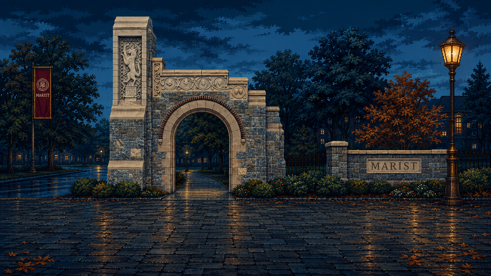
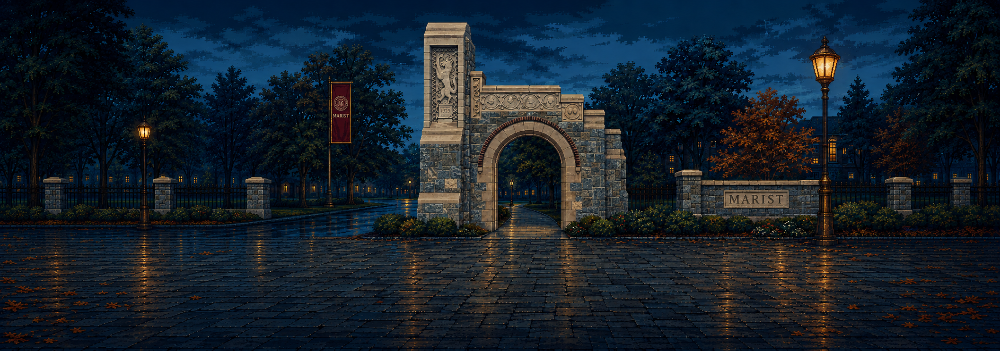
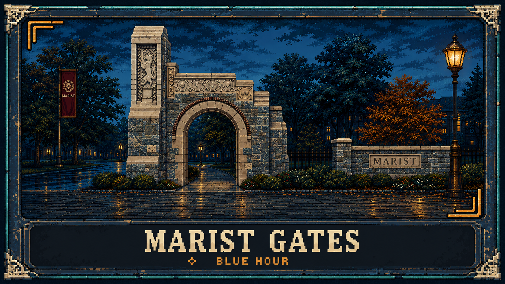

# Marist Gates — Blue Hour

An additional **AFTER HOURS** stage design for the traditional-fighter variant, inspired by the front entrance of Marist College in Poughkeepsie. Cool blue stone, dark ironwork, autumn foliage and warm entrance lamps extend the pack's ink, amber, teal and cream palette into a campus setting. The illustration is original; it makes no claim of institutional endorsement.

This folder is a separate source-art and handoff package for an eventual selectable stage. **It is not registered in the game and is not currently a playable stage.** Existing prototype code, canonical stage data, production graphics and the original art gallery are not replaced by this package. No platform-fighter content is involved.

| File | Intended use |
| --- | --- |
| `background.png` | 16:9 presentation composition for reviewing the look of a match viewport |
| `panorama.png` | Wide composition candidate for eventual horizontal camera coverage |
| `select-card.png` | Stage-menu art reference with a title; production menu text should remain live |
| [stage.proposed.json](stage.proposed.json) | Proposed stage ID, display name and matching competitive geometry |
| [integration.json](integration.json) | Design coordinates, image roles and unimplemented integration requirements |

Image generation and inspection metadata alongside the artwork determine each PNG's actual dimensions and format. The sizes below are **production targets**, not assertions about the generated source files. These are finished design illustrations, not normalized engine textures or an already separated parallax set.

## Art and composition

The proposed selection label is **Marist Gates — Blue Hour**, with stable ID `marist_gates`. Architectural features establish the entrance while the central contact area stays low in contrast and free of foreground obstacles. Lamp highlights and subdued red foliage carry the setting without overwhelming fighter silhouettes or impact effects. Gate structures, walls, slopes and landscaping are background scenery; none adds a combat platform, hazard or collision boundary.

The background and panorama are separate compositions. Do not assume that cropping one recreates the other exactly. Use the panorama as the starting point for world coverage and the background as a look reference. The selection card is a menu concept; rebuild its title and focus state with the game's live interface when integrating it.

## Coordinate contract

The proposed numeric stage matches `data/stages/foundry.json`: left wall **0**, right wall **768000**, floor **0**, player spawns **288000 / 480000**, and visible camera width **480000**, all in the existing milliunit system. There are no hazards or platforms. Appearance must not change collision, movement, attack reach, timing or economy.

| Target | Value |
| --- | --- |
| Working match viewport | 640 × 360 design pixels |
| Current presentation | 1280 × 720 pixels |
| Fighter foot-contact line | Design y=302; presentation y=604 |
| Complete world-width artwork | 1024 × 360 design pixels |
| Camera world-X clamp | 240000–528000 |
| Panorama camera-center X | 320–704 design pixels |
| Panorama crop-left X | 0–384 design pixels |

At design scale, `screenX = 320 + (worldX - cameraX) / 750` and `screenY = 302 - worldY / 750`. A normalized, world-anchored panorama uses `panoramaX = worldX / 750`, so a 640-pixel viewport begins at `cameraX / 750 - 320`.

Check the **left crop [0,640)**, **center crop [192,832)** and **right crop [384,1024)**. The initial camera center is world X=384000, corresponding to panorama X=512. Initial fighter roots therefore appear at design screen X=192 and X=448. These calculations describe the future normalized texture; an image must first be reviewed and fitted to that coordinate contract.

Keep essential combat silhouettes clear beneath the upper HUD, approximately design y=0–77. The normal footer begins around y=336 and the training footer around y=305. The walkable plane must read as continuous at y=302. Perspective seams are decoration and must stay world-anchored after import.

## Future integration

1. Preserve these source PNGs. Normalize copies to the working pixel grid, repair unwanted smoothing or inconsistent pixel clusters, align the floor to y=302, and verify integer scaling with nearest filtering and no mipmaps. Confirm both camera extremes without stretching a 16:9 viewport image across the full world.
2. Decide whether to ship one flattened background or author separate sky, campus, gate, light and floor layers. The supplied illustrations are **single-layer art**; independent parallax, animated foliage, light masks and transparent overlays are not delivered. A flattened world-anchored texture is a valid initial production treatment.
3. Add the approved stage definition to canonical data and the normal generated-data build. The current `GameContent.Load` explicitly requires exactly two stages; simply copying this proposal into `data/stages` will fail that existing check. Update the bounded roster contract and its relevant validation together when integration is commissioned.
4. Add a selection entry, keyboard/controller focus states and a confirmed stage ID. The current `ArenaRenderState` exposes a training-grid flag, and `ArenaView` chooses between foundry and grid textures; future stage-ID presentation routing is required. Its current 1344-pixel backdrop scaling and small cosmetic drift are not the panorama crop formula above.
5. Carry the selected ID through match setup, private-match agreement and replay configuration. `MatchConfig.StageId` already identifies simulation geometry, and canonical snapshots serialize and verify it alongside the content hash. Both peers must agree before a match starts; a replay must resolve its recorded ID. Do not silently substitute another stage or change a running match's ID.
6. Verify geometry equivalence, both corners, feet, jumps, mirror palettes, HUD readability, selection persistence, private agreement, replay restore and the missing-asset/unknown-ID path. Keep the existing training grid available for diagnostics.

Selection is proposed for CPU, local versus and private matches, with a confirmed choice retained for a rematch. The exact menu and private-match selection policy remains an implementation decision; this package introduces no protocol or gameplay rule. The stage has no unlock price or wallet effect.

The existing [art direction](../../docs/ART_DIRECTION.md) and [future swap guide](../../docs/SWAP_GUIDE.md) remain useful reference material. Current source inspection for this proposal includes `data/stages/foundry.json`, `src/StrikeLedger.Core/GameContent.cs`, `src/StrikeLedger.Core/SimulationState.cs`, `src/StrikeLedger.Core/Simulation.Serialization.cs`, `game/Main.Rendering.cs` and `game/Presentation/ArenaView.cs`. Recheck them at integration time because prototype development may continue independently.

## Saved source art

All three were generated with built-in image_gen. See [exact prompts](prompts.json), [architectural references](SOURCES.md), [asset dimensions and hashes](ASSET_MANIFEST.json), and [verification](VERIFICATION.json). The supplemental folder is independently cataloged so the original 22-image pack and its gallery remain intact.
