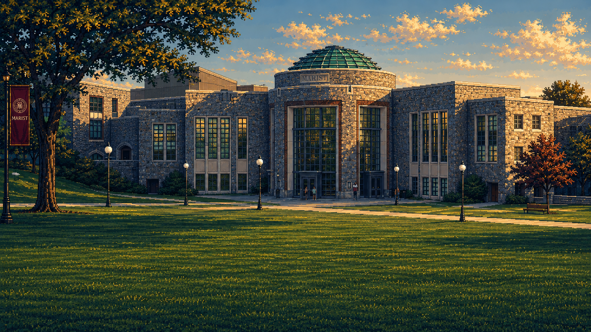
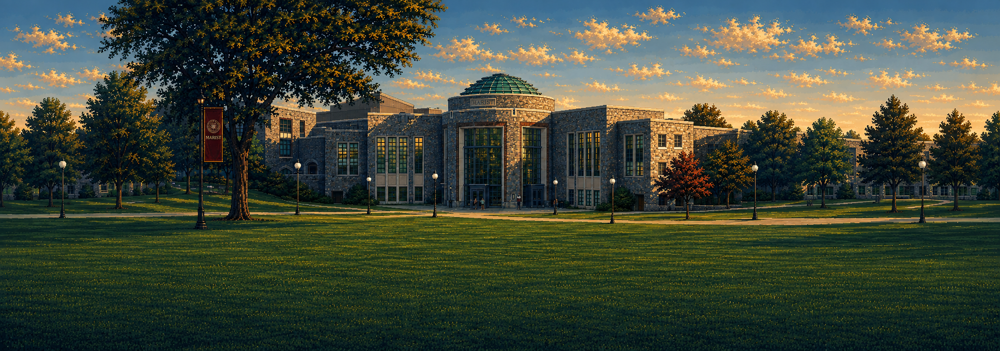
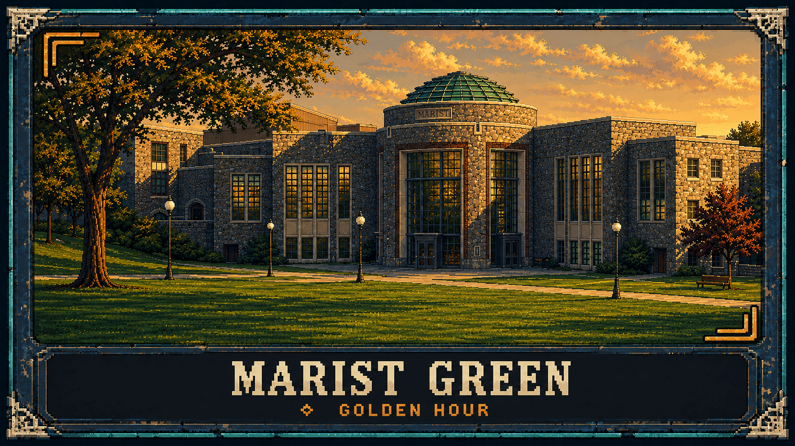

# Marist Green — Golden Hour

An original **AFTER HOURS** stage design for the traditional-fighter variant: the central Marist College Green facing the Murray Student Center Rotunda, with a broad lawn, warm stone, late-afternoon amber light and cool teal shadows. Its proposed stage ID is `marist_green`.

This is a separate art package for eventual stage selection and integration. **The stage is not registered or playable in the current game.** Existing stage art, runtime files, canonical data and the original gallery remain untouched by this addition. The setting is an original illustrated interpretation with no institutional endorsement claimed.

## Artwork

**Match composition** — a 16:9 look reference.

**Wide panorama** — a candidate for horizontal camera coverage.

**Stage-selection card** — artwork and title treatment for a future menu.

The three PNGs are separate compositions; the match image is not promised to be an exact crop of the panorama. They are flattened source illustrations. Separate parallax layers, animation, transparent masks and normalized engine textures are not delivered. Actual native dimensions and image metadata belong in [integration.json](integration.json) after inspection; the sizes below are production targets.

## Lawn and camera handoff

Use the lawn as a continuous, level, side-on fighting plane. Flatten the depicted turf along the fighter foot-contact line at **design y=302**, equivalent to **y=604 at 1280 × 720**. Keep campus slopes, terrace edges, paths, stairs and the Rotunda behind the combat plane as scenery. Grass detail should stay quiet around feet and must not hide low attacks or imply uneven collision.

| Contract | Target |
| --- | --- |
| Match viewport | 640 × 360 design pixels |
| Full world panorama | 1024 × 360 design pixels |
| Walls / floor, world milliunits | 0 and 768000 / 0 |
| Player spawns, world milliunits | 288000 and 480000 |
| Visible camera width | 480000 world milliunits |
| Camera world-X clamp | 240000–528000 |
| 640-wide panorama crop starts | Left 0; center 192; right 384 |

The proposed geometry in [stage.proposed.json](stage.proposed.json) matches the existing Foundry stage. It adds no hazards, platforms, collision slopes, activation price or wallet effect. At design scale, `screenX = 320 + (worldX - cameraX) / 750`, `screenY = 302 - worldY / 750`, and the panorama crop begins at `cameraX / 750 - 320`.

Before integration, normalize copies to one coherent pixel grid, align the lawn to the exact floor, and inspect the left, center and right camera crops. Use nearest filtering, no mipmaps and integer display scaling after cleanup. Check that fighters, mirror palettes, impacts and the upper HUD remain readable against windows and foliage. The training footer starts near design y=305, so decorative foreground detail needs a check in that mode too.

## Integration remains future work

The shared [Marist Gates handoff](../marist-gates/README.md#future-integration) documents the existing loader, presentation, menu and replay hooks. They also apply here: the loader currently requires exactly two stages, the renderer selects only foundry or grid, and canonical snapshots validate `StageId` and content identity. This proposal alone does not implement another menu entry or texture route.

Add an explicit stage choice for CPU, local versus and private matches when integration is commissioned; confirm it before match creation and preserve it on rematch. Both private peers must agree on the same ID, and replays must resolve their recorded stage. Keep the diagnostic training grid available. Rebuild the card title and focus states with live UI rather than relying on baked raster text.

[integration.json](integration.json) records the concise production contract. Refer to the pack's [art direction](../../docs/ART_DIRECTION.md) and [swap guide](../../docs/SWAP_GUIDE.md) for the shared pixel-art and presentation requirements. The original source PNGs should remain intact when production copies are made.

## Generation and verification

Created with built-in image_gen. See [exact prompts](prompts.json), [architectural sources](SOURCES.md), the [asset manifest](ASSET_MANIFEST.json), and [verification results](VERIFICATION.json).
